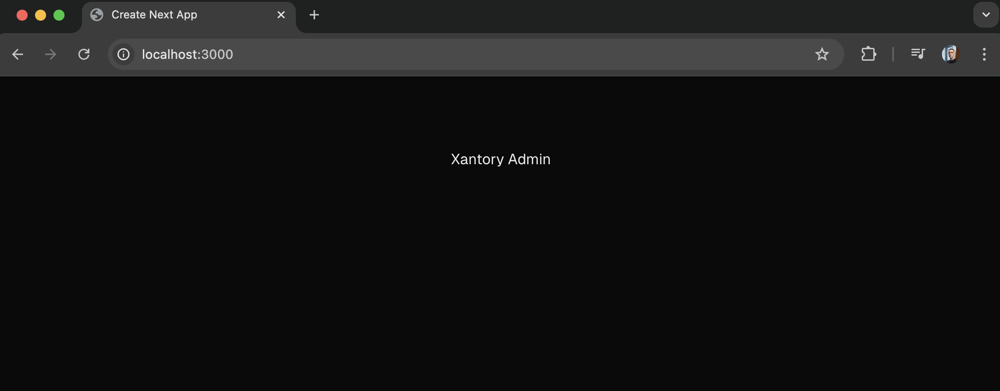

# Installation

```shell copy
npx create-next-app@latest
```


```shell copy
cd xantory-admin
```

```shell copy
yarn install
yarn add lucide-react numeral recharts uuid axios
yarn add -D @types/node @types/uuid @types/numeral
```


```jsx filename="/src/app/page.tsx" copy
export default function Home() {
  return (
    <div className="grid grid-rows-[20px_1fr_20px] items-center justify-items-center min-h-screen p-8 pb-20 gap-16 sm:p-20 font-[family-name:var(--font-geist-sans)]">
      <h1>Xantory Admin</h1>
    </div>
  );
}
```

```shell copy
yarn dev
```



